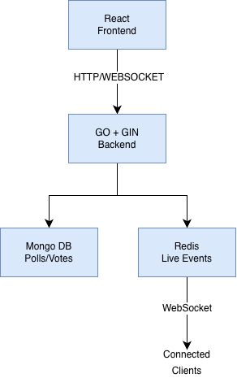

# Real-Time Polling App

A full-stack real-time application that allows users to create polls, share them with an audience, collect votes, and see results update instantly without refreshing the page. 

## Tech Stack

- React
- Go
- Gin
- MongoDB
- Redis
- JWT Authentication
- WebSockets

## Features

- User authentication with JWT
- Poll creation with multiple options
- Shareable poll links
- Audience voting without requiring an account
- Real-time vote count updates
- Redis-powered real-time event handling 
- WebSockry-based live updates
- One vote per browser per poll
- Server-side Validation
- Live results with vote counts and percentages 
- Poll management and deletion

## Architecture

## How Real-Time Voting Works

- A user creates a poll through the React frontend.
- the Go/Gin backend validates and stores the poll in MongoDB.
- Audience members open the shared poll link and submit votes.
- The backend validates the vote and stores it in MongoDB.
- The updated vote results are published through Redis. 
-  WebSocket clients recieve the update immediately.
- All connected users see the updates results without refreshing the page.

## Security & Validation

- JWT-based authentication protects poll management operations.
- Poll creation and management require authentication.
- Voting endpoints perform server-side validation. 
- Duplicate votes from the same browser are rejected. 
- Poll owners can close voting.
- Closed polls reject further votes.
- Sensitive environment variables are excluded from Git using .gitignore.

## Running Locally 

Prerequistes
- Node.js
- Go
- MongoDB Atlas
- Redis

1. Clone the Repository 

git clone https://github.com/janazees/Polling_app.git cd Polling_app

2. Configure the Backend

Create a .env file inside the backend directory:

MONGODB_URI=your_mongodb_connection_string
JWT_SECRET=your_jwt_secret

Make sure Redis is running locally on:

localhost:6379

3. Start the backend 

cd backend
go run main.go

The backend runs on:

http://localhost:8080

4. Start the frontend

Open another terminal:

cd frontend
npm install
npm run dev

The frontend runs on:

http://localhost:5173

## Project Overview 

This project demonstrates full-stack development with a focus on real-time communication, authentication, database integration, and event-driven updates using React, Go, MongoDB, Redis, and WebSockets.

